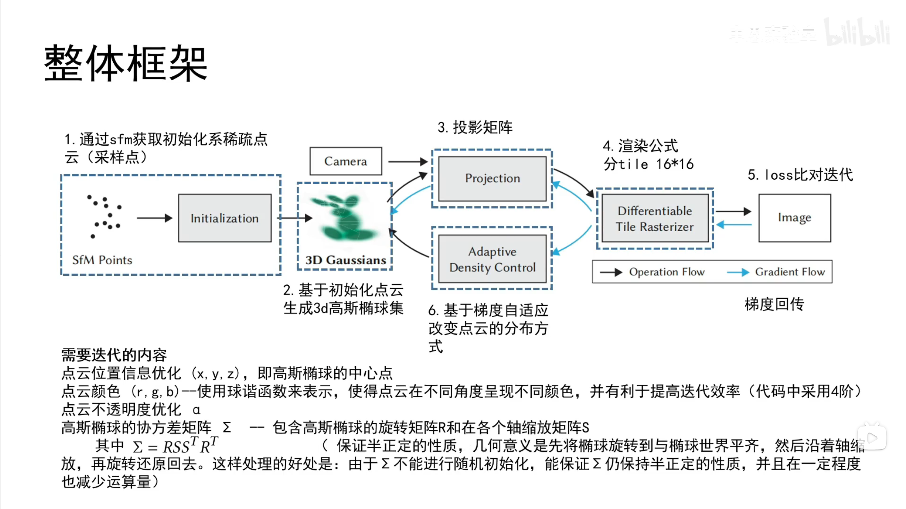

# 整体框架



---
## 1. sfm初始化稀疏点云

![[屏幕截图 2026-03-17 201330.png]]

- sfm (Structure from Motion) : 从多张照片中，推算出相机的位置和三维结构（点云）
- COLMAP (sfm工具) : 自动完成 ：
```
照片
↓
特征提取
↓
特征匹配
↓
相机位姿
↓
稀疏点云
```

---
## 2. 生成3D高斯椭球集

---
### 2.1 位置与形状

![[屏幕截图 2026-03-17 201358 2.png]]

- 优化后的点云位置 (x , y , z) 即为高斯椭球中心
- R ：旋转矩阵  
- S ：伸缩矩阵

---
### 2.2 不同角度颜色表达 - 球谐函数

![[屏幕截图 2026-03-17 201107.png]]
![[屏幕截图 2026-03-17 201506.png]]

---
## 3. 投影矩阵

从透视投影到正交投影，把高斯椭球投影到相机2d平面，类似于光栅化
![[屏幕截图 2026-03-17 201602.png]]

---
## 4. 渲染

![[屏幕截图 2026-03-17 201736.png]]

- 将相机2D平面分割为 **a * a** 的像素点， 像素位置 **(u , v)**，平面内会有多个高斯椭球，其中心在2D平面投影的位置离 **(u , v)** 的距离也会影响 **αi** 的权重
- **ci** 为球谐函数输出的 RGB

---
## 5. Loss对比迭代

![[屏幕截图 2026-03-17 201855.png]]

- L1 ：像素误差
- LD-SSIM ：结构相似度
#### 根据 **Loss** 优化
- 初始点云位置
- 协方差矩阵（椭球大小）
- 颜色值
- 不透明度

---
## 6. 基于梯度的自适应改变点云分布方式

![[屏幕截图 2026-03-17 201802.png]]

- 梯度大 -> 误差大
- 方差大 -> 一个大高斯无法表达细节 -> 分裂
- 方差小 -> 高斯小无法完全表达 -> 克隆

---
# 伪代码

![[屏幕截图 2026-03-17 201920.png]]

- 通过 **SfM** 得到 **初始化点云 M** （包含位置u(x , y , z)）
- 得到 
	- S ：sclae / covariance，协方差
	- C ：color，颜色
	- A ：opacity，不透明度
- 迭代次数 **i** 初始化为 0
- 如果未收敛
- 从数据集中得到 **相机位姿 V** 和 **真实iamge I-hat**
- 传入 **初始化点云**，**初始化点云形状**，**初始化颜色**，**初始化不透明度**，以及 **相机位姿**，通过光栅化得出推理出的 **image I**
- 将 **I** 与 **I-hat** 进行Loss比对计算出 **Loss**
- 根据Loss梯度，通过Adam优化器优化 **初始化点云位置**，**协方差（点云形状）**，**颜色**，**不透明度**，然后梯度回传
- 设置优化步数
- 对所有高斯进行判断
- 删除 **不透明度α** 小于某个阈值 或者 **离相机过近** 的点
- 如果 **Loss梯度** 大于某个阈值
	- 判断协方差
		- 过大 -> 分裂
		- 过小 -> 克隆
- 下一轮迭代

https://www.bilibili.com/video/BV1FC4y1k79X/?share_source=copy_web&vd_source=01a5d1502e3493ab0cdcab0526683a07

https://www.bilibili.com/video/BV1rJ4m1g7Un/?share_source=copy_web&vd_source=01a5d1502e3493ab0cdcab0526683a07


