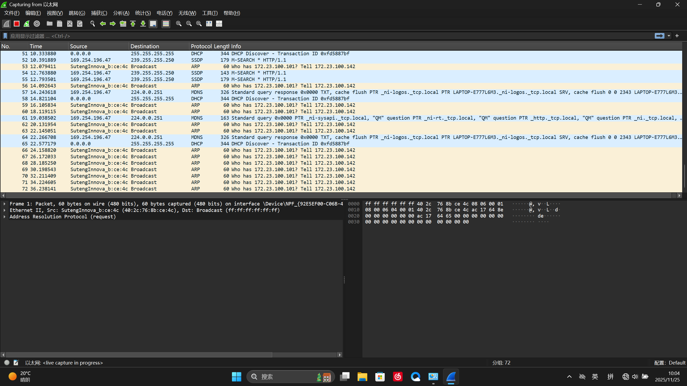
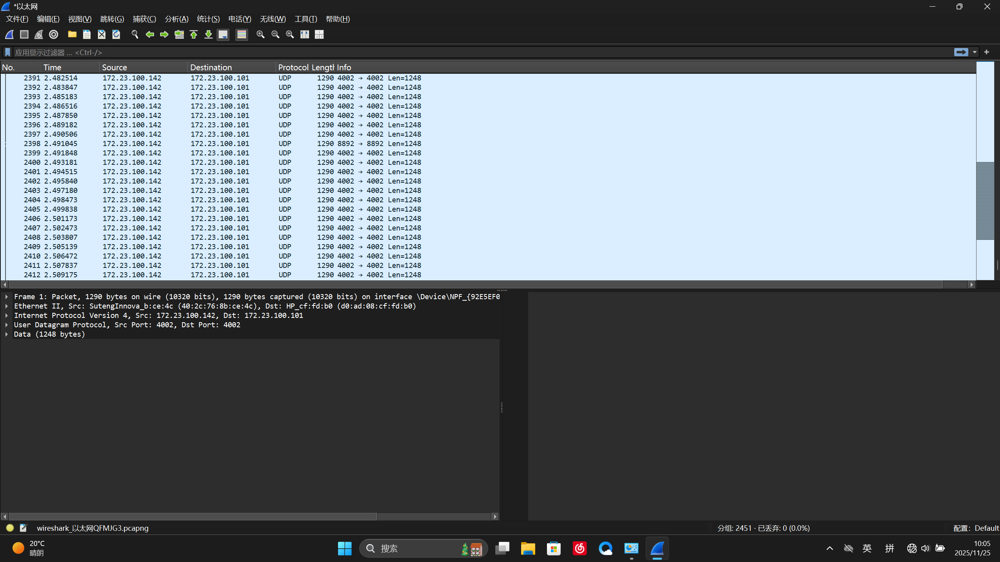

# 1. Windows显示
## 1.1 硬件配置
1. windows10 / 11
2. 使用一根支持至少100Mbps的网线连接电脑与雷达（先不打开雷达电源）
## 1.2 软件资源
1. RSVIEW http://www.robosense.cn/resources （Helios系列）
2. Wireshark https://2.na.dl.wireshark.org/win64/Wireshark-4.6.1-x64.exe
## 1.3 电脑配置
### 1.3.1 网线接口速率配置
#### 1.3.1.1 网线接口速率配置
1. 设备管理器 -> 网络适配器 -> Realtek Gaming GbE Family Controller
2. 双击 -> 高级 -> 连接速度和双工模式 -> 自动侦测或者大于100M的全双工模式
#### 1.3.1.2 验证
连接好并打开雷达电源，powershell中输入
``` Powershell
Get-Netadapter
```
确认Name为**以太网**的LinkSpeed为**100Mbps**
### 1.3.2 ip设置
#### 1.3.2.1 wireshark抓包查看ip
1. 打开Wireshark
2. 选择以太网，双击打开
3. 会看见如下类似输出，停止接收，以防卡顿

其中
**60 who has 172.23.100.101？Tell 172.23.100.142**<br>
则**172.23.100.101**就是我们要填的ip地址，*以下都使用此ip地址作为示例*
#### 1.3.2.2 更改ip  
1. 控制面板 -> 所有控制面板项 -> 网络和共享中心 ->更改适配器设置
2. 找到以太网 **Realtek Gaming GbE Family Controller**
3. 右键 -> 属性 -> Internet 协议版本4（TCP/IPv4）-> 
- 使用下面的IP地址 
	- IP地址：172.23.100.101
	- 子网掩码：255.255.255.0
	- 默认网关：不填
- 使用下面的DNS服务器地址（都不填）
## 1.4 RSVIEW设置
### 1.4.1 wireshark抓包查看端口号
继续Wireshark输出，此时能看到类似如下输出，停止输出

其中
- 出现次数多的**1290 4002 -> 4002 Len=1248**，则**4002**为MSOP Port
- 出现次数少的**1290 8892 -> 8892 Len=1248**，则**8892**为DIFOP Port<br>
*以下都使用此端口号作为示例*
### 1.4.2 RSVIEW设置
1. 左上雷达图标（open sensor）
2. sensor tpye -> RS16 -> OK
3. 
- MSOP Port = 4002
- DIFOP Port = 8892
- 其余默认 -> OK

# 2. ROS2显示
## 2.1 硬件配置
使用一根支持至少100Mbps的网线连接电脑与雷达（先不打开雷达电源），主机需连接wifi，如果不能，请将此步移至**步骤2.3**之后
## 2.2 虚拟机设置1
1. 使用VMware Workstation Pro，ros-jazzy-desktop
*最好请下载ROS2 desktop-full版，如若不是，请参考 https://github.com/RoboSense-LiDAR/rslidar_sdk/blob/main/README_CN.md
2. 保持虚拟机关机状态下
	编辑虚拟机设置 -> 网络适配器 -> 选择**net模式**
## 2.3 资源下载
1. 创建工作空间
``` bash
mkdir -p ~/3dlidar_ws/src
cd ~/3dlidar_ws/src
colcon build
```
2. 下载资源
``` bash 
cd ~/3dlidar_ws/src
#克隆SDK包
git clone https://github.com/RoboSense-LiDAR/rslidar_sdk.git
#克隆消息包
git clone https://github.com/RoboSense-LiDAR/rslidar_msg.git
cd rslidar_sdk
git submodule init
git submodule update
#下载libpcap 版本号：>= v1.7.4
sudo apt-get install -y  libpcap-dev
colcon build
source install/setup.bash
```
## 2.4 更改配置文件参数
``` bash
#或者直接在主目录中打开
nano ~/3dlidar_ws/src/rsLiDAR_sdk/config/config.yaml
```
*config.yaml遵循YAML格式。该格式对缩进有严格要求。修改config.yaml之后，请确保每行开头的缩进仍保持一致*
### 2.4.1 commen部分
``` yaml
common:
  msg_source: 1                                   
  send_packet_ros: false                
  send_point_cloud_ros: true
#具体原因参考文件注释及官方文档
```
### 2.4.2 lidar部分 
``` yaml
lidar:
  - driver:
      lidar_type: RS16             #  雷达型号
      msop_port: 4002              #  Msop port of lidar
      difop_port: 8892             #  Difop port of lidar
#其余参数根据雷达型号和具体要求改变，此示例无需修改
```
## 2.5 环境设置
### 2.5.1 主机设置
#### 2.5.1.1 关闭Hyper-V和wsl2
 主机打开Powershell
``` Powershell
dism.exe /Online /Disable-Feature /FeatureName:Microsoft-Hyper-V-All /NoRestart
dism.exe /Online /Disable-Feature /FeatureName:VirtualMachinePlatform /NoRestart
dism.exe /Online /Disable-Feature /FeatureName:HypervisorPlatform /NoRestart
dism.exe /Online /Disable-Feature /FeatureName:WindowsSubsystemForLinux /NoRestart
bcdedit /set hypervisorlaunchtype off
#完成后重启
```
#### 2.5.1.2 验证 
主机Powershell输入
```
systeminfo
```
输出的 Hyper-V 要求 中
- 要有  **虚拟机监视器模式扩展: 是**
- 不要有 **A hypervisor has been detected**
### 2.5.2 虚拟机设置2
#### 2.5.2.1 桥接模式设置
1. 虚拟机关机
2. VMware中
	1. 编辑 -> 虚拟机网络编辑器  -> Vmnet0 -> 桥接模式 -> 连接至**有线网口所对应的网卡（一般是物理网卡）Realtek Gaming GbE Family Controller** -> 应用，确认
	2. 编辑虚拟机设置 -> 网络适配器 -> 选择**桥接模式**，勾选**复制物理网络连接状态**
3. 主机中
	1. 控制面板 -> 所有控制面板项 -> 网络和共享中心 ->更改适配器设置
	2. 找到以太网 **Realtek Gaming GbE Family Controller**
	3. 右键 -> 属性 -> 勾选VMware Bridge Protocol
#### 2.5.2.2 验证
主机cmd输入
``` cmd
sc query vmnetbridge
```
应有输出 
``` cmd
STATE              : 4  RUNNING
```
## 2.6 关闭防火墙
打开虚拟机，bash中
``` bash
sudo ufw disable
#用完记得开回来
```
## 2.7 虚拟机IP设置
### 2.7.1 确认桥接的物理网卡名称
bash中
``` bash
ip a
```
有如下类似输出
``` bash
1: lo: <LOOPBACK,UP,LOWER_UP> mtu 65536 qdisc noqueue state UNKNOWN group default qlen 1000
    link/loopback 00:00:00:00:00:00 brd 00:00:00:00:00:00
    inet 127.0.0.1/8 scope host lo
       valid_lft forever preferred_lft forever
    inet6 ::1/128 scope host noprefixroute 
       valid_lft forever preferred_lft forever
2: ens33: <BROADCAST,MULTICAST,UP,LOWER_UP> mtu 1500 qdisc fq_codel state UP group default qlen 1000
    link/ether 00:0c:29:ba:50:bc brd ff:ff:ff:ff:ff:ff
    altname enp2s1
```
ens33就是我的物理网卡名称
*物理网卡的名称通常为ensXX，enpXsX等，如上所示为ens33，以下网卡名称统一使用ens33作为示例*
### 2.7.2 虚拟机ip更改 （临时配置）
bash中
``` bash
sudo ip addr add 172.23.100.101/24 dev ens33
sudo ip link set dev ens33 up
ip a
```
应能看见ens33处出现IP地址，如
``` bash
2: ens33: <BROADCAST,MULTICAST,UP,LOWER_UP> mtu 1500 qdisc fq_codel state UP group default qlen 1000
    link/ether 00:0c:29:ba:50:bc brd ff:ff:ff:ff:ff:ff
    altname enp2s1
    inet 172.23.100.101/24 scope global ens33
       valid_lft forever preferred_lft forever
```
## 2.8 Rivz2显示点云图
1. 打开雷达电源
2. bash中
``` bash
cd ~/3dlidar_ws
colcon build
source install/setup.bash
ros2 launch rslidar_sdk start.py
```


